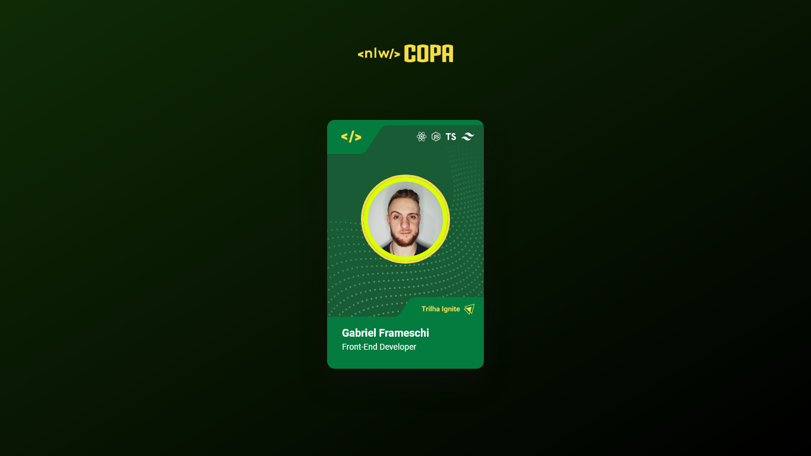

<h1 align="center"> ⚽ NLW Copa - Cards ⚽ </h1>

Esse projeto foi desenvolvido durante a fase de aquecimento do evento <strong>NLW Copa</strong> da <a href="https://github.com/Rocketseat" target="_blank">@rocketseat</a> e criado originalmente pelo grande <a href="https://github.com/maykbrito" target="_blank">@maykbrito</a>.

  <a href="#-tecnologias">Tecnologias</a>&nbsp;&nbsp;&nbsp;|&nbsp;&nbsp;&nbsp;
  <a href="#-projeto">Projeto</a>&nbsp;&nbsp;&nbsp;|&nbsp;&nbsp;&nbsp;
  <a href="#-layout">Layout</a>

## 🛠️ Tecnologias
- HTML e CSS
- JavaScript

## 📋 Projeto
A ideia do projeto era recriar os **cards temáticos** das trilhas Ignite e Explorer do **NLW Copa**, além de possibilitar a visualização de cada trilha ao **clicar sobre o card**.

🔗 [Para ver o resultado final, é só clicar aqui](https://framesgabriel.github.io/nlw-copa-cards/)

🔗 Já para acessar o tutorial original e completo, [e só clicar aqui](https://www.youtube.com/watch?v=sswJisbD2CY).

## 🎨 Layout
Todo o layout do projeto foi disponibilizado no [Figma da Rocketseat](https://www.figma.com/file/cYdPXNkAEyTGi5lIJI3Adu/NLW-Copa-Card-Copy?fuid=1008739768180921995).